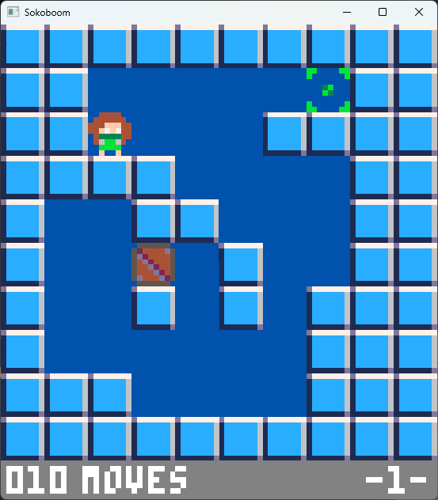
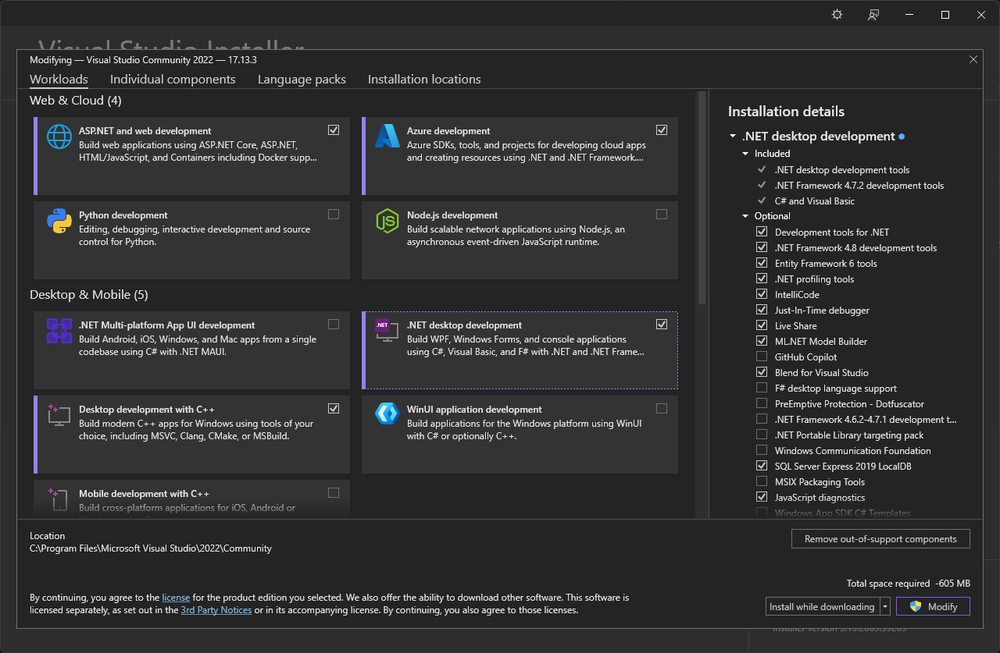
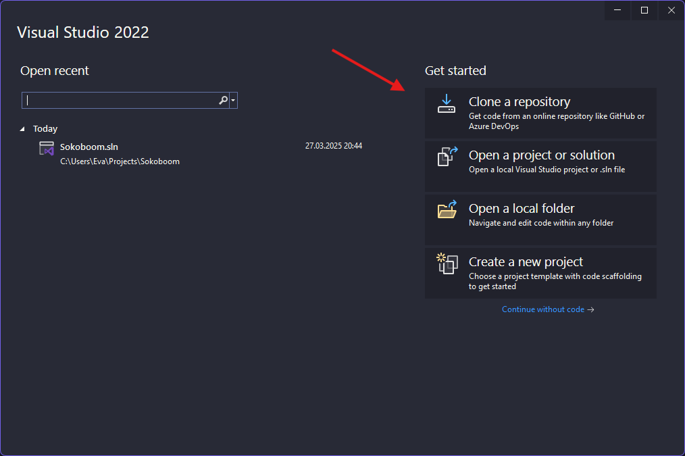
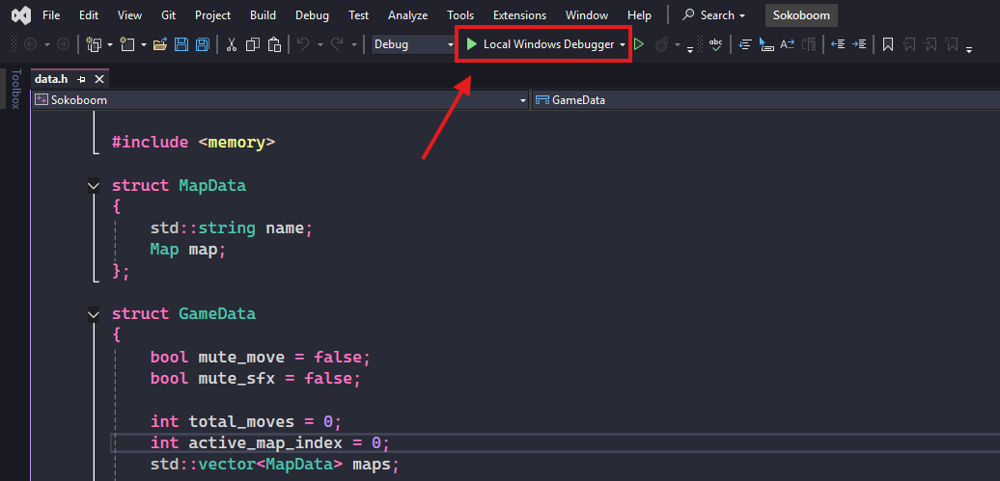

# Sokoboom

Sokoboom is a C++ Sokoban clone with 10 levels!  
Made with my own TileMap Editor, [PicoMapper](https://github.com/EveMeows/PicoMapper)!

## Showcase

## Credits
The font used throughout the game is made by Zep and the Pico8 team.

## Installation

### Using the releases page (recommended)
First, head over to the [releases page](https://github.com/EveMeows/Sokoboom/releases)!  
Look for the latest release, and simply click the windows zip file, after it is downloaded, unzip, and done!

### Compiling and running manually (advanced)
If you wish to make modifications, or even contribute to the game, you can compile it yourself!

#### Downloading visual studio
First, you must download Visual Studio 2022. Head over to the [official site](https://visualstudio.microsoft.com/), and click "Download Visual Studio".

Run "VisualStudioSetup.exe". Once the setup finishes, you will see a window akin to the one below.

Click "Desktop development with C++" then at the bottom right corner, click the button with the Administrator Shield (it may have different text).

After the installer is done, you should be able to just start Visual Studio!

#### Running the application
Time to compile and run the application.

Open Visual Studio. You should see something like this.

Click the "Clone a repository" button.

On the next screen, paste "https://github.com/EveMeows/Sokoboom" into the "Repository location" field. You are free to change the "Path" field however you like. Click "Clone"

Once the editor is done loading, and cloning the repository, you should see an empty window. At the top left corner to middle centre you should see a green button, "Local Windows Debugger" next to it.

Click it, and, after the app compiles, you're done! You should be able to run the game.

## License
MIT
